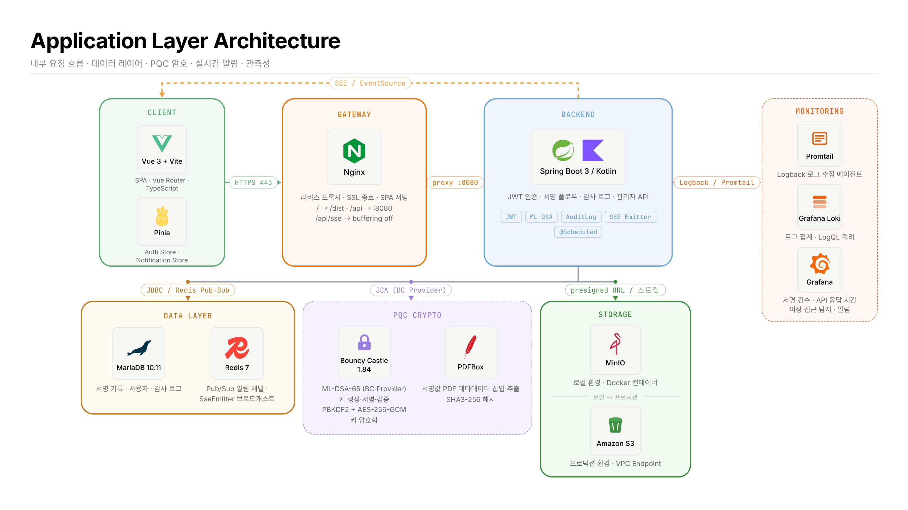
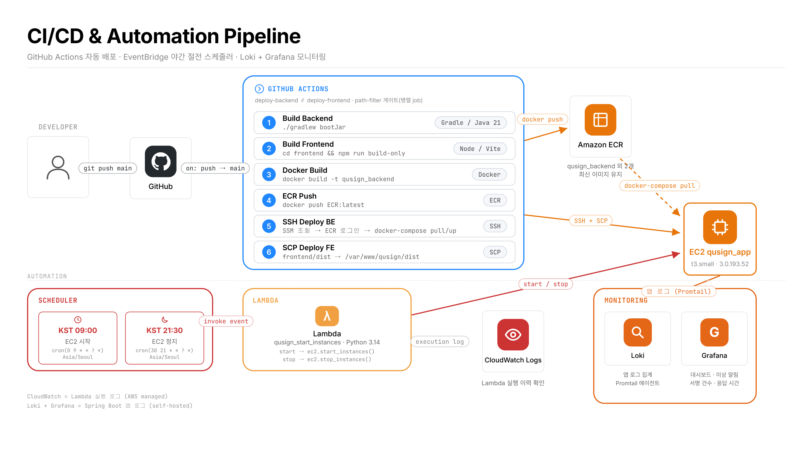
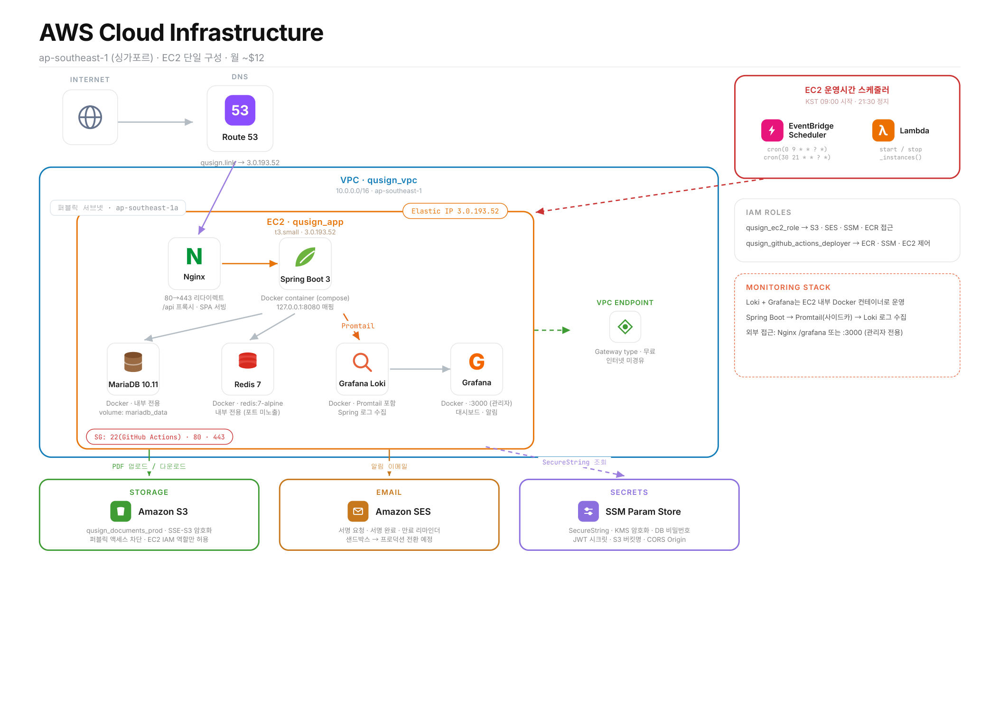

# QuSign

> NIST PQC 표준 ML-DSA 기반 전자서명 SaaS

양자 컴퓨터 시대에 안전한 전자서명 서비스. 기존 RSA/ECDSA 대신 NIST 표준 ML-DSA(CRYSTALS-Dilithium)를 적용한다.

---

## 📋 목차

- [기술 스택](#기술-스택)
- [테스트](#테스트)
- [API 문서](#api-문서)
- [진행 현황](#진행-현황)
- [아키텍처](#아키텍처)

---

## 기술 스택

| 레이어 | 기술 |
|--------|------|
| **백엔드** | Kotlin + Spring Boot 3.5, Gradle Kotlin DSL |
| **암호화** | Bouncy Castle 1.84 (ML-DSA-65), PDFBox 3.x |
| **DB** | MariaDB 10.11 + Flyway |
| **스토리지** | MinIO (로컬) → AWS S3 (운영) |
| **메시지** | Redis 7 (Pub/Sub + 실시간 알림) |
| **프론트엔드** | Vue 3 + Vite + Pinia + Vue Router + TypeScript |
| **인프라** | Docker Compose → AWS EC2/RDS → Terraform |

---

## 테스트

```bash
cd backend
./gradlew test
```

---

## API 문서

**[Swagger UI → https://qusign.link/swagger-ui/index.html](https://qusign.link/swagger-ui/index.html)**

전체 엔드포인트 명세·요청·응답 스키마·Try it out 기능 제공.

---

## 진행 현황

| 단계 | 내용 | 상태 |
|------|------|------|
| **1단계** | 환경 세팅 + PQC 핵심 검증 | ✅ 완료 |
| **2단계** | 백엔드 핵심 구현 | ✅ 완료 |
| **3단계** | 프론트엔드 구현 | ✅ 완료 |
| **4단계** | 기능 고도화 & 품질 강화 | 🔄 진행 중 |
| **5단계** | 보안 취약점 개선 (OWASP Top 10) | ✅ 완료 |
| **6단계** | AWS 배포 + SES + GitHub Actions | 🔄 진행 중 |
| **7단계** | Terraform + 수익화 | ⬜ 진행 전 |
| **8단계** | Loki + Grafana + 이직 준비 | ⬜ 진행 전 |

세부 계획 → [docs/exec-plans/PLAN.md](docs/exec-plans/PLAN.md)

---

## 아키텍처




<table width="100%">
<thead>
<tr>
<th width="25%">구성</th>
<th width="75%">설명</th>
</tr>
</thead>
<tbody>
<tr>
<td><strong>Client</strong><br>Vue 3 + Vite / Pinia</td>
<td>TypeScript 기반 SPA · Vue Router로 클라이언트 사이드 라우팅<br>Pinia: Auth Store(JWT 토큰) · Notification Store(실시간 알림 상태) 분리 관리<br>Nginx를 통해 <code>HTTPS 443</code>으로 API 호출 · SSE EventSource로 실시간 알림 수신</td>
</tr>
<tr>
<td><strong>Gateway</strong><br>Nginx</td>
<td>리버스 프록시 · SSL 종료 · SPA 정적 파일 서빙<br><code>/</code> → <code>/dist</code> (Vue 빌드 산출물) · <code>/api</code> → <code>:8080</code> (백엔드 프록시)<br><code>/api/sse</code> → <code>proxy_buffering off</code>로 SSE 스트리밍 유지</td>
</tr>
<tr>
<td><strong>Backend</strong><br>Spring Boot 3 / Kotlin</td>
<td>JWT 인증 · 서명 플로우 · 감사 로그 · 관리자 API 처리<br>핵심 기능: <code>JWT</code> · <code>ML-DSA</code> · <code>AuditLog</code> · <code>SSE Emitter</code> · <code>@Scheduled</code><br>아래 세 레이어(Data / PQC / Storage)에 단방향 의존</td>
</tr>
<tr>
<td><strong>Data Layer</strong><br>MariaDB 10.11 / Redis 7</td>
<td><strong>MariaDB</strong>: 서명 기록 · 사용자 · 감사 로그 (append-only) 저장 — JDBC 연결<br><strong>Redis</strong>: Pub/Sub 알림 채널 · SseEmitter 브로드캐스트 · 실시간 이벤트 전달</td>
</tr>
<tr>
<td><strong>PQC Crypto</strong><br>Bouncy Castle 1.84 / PDFBox</td>
<td><strong>Bouncy Castle (BC Provider)</strong>: ML-DSA-65 키 생성 · 서명 · 검증 / PBKDF2 + AES-256-GCM 개인키 암호화<br><strong>PDFBox</strong>: 서명값 PDF 메타데이터 삽입·추출 · SHA3-256 문서 해시 계산<br>JCA Provider 인터페이스로 Backend에서 호출 (Controller 직접 접근 금지)</td>
</tr>
<tr>
<td><strong>Storage</strong><br>MinIO / Amazon S3</td>
<td><strong>MinIO</strong>: 로컬 환경 — Docker 컨테이너로 S3 호환 오브젝트 스토리지 에뮬레이션<br><strong>Amazon S3</strong>: 프로덕션 환경 — VPC Endpoint 경유로 인터넷 미노출 PDF 저장<br>Presigned URL / 스트림 방식으로 파일 업·다운로드</td>
</tr>
<tr>
<td><strong>Monitoring</strong><br>Promtail / Loki / Grafana</td>
<td><strong>Promtail</strong>: Logback 로그 수집 에이전트 (사이드카 방식)<br><strong>Grafana Loki</strong>: 로그 집계 · LogQL 쿼리 엔진<br><strong>Grafana</strong>: 서명 건수 · API 응답 시간 대시보드 · 이상 접근 탐지 · 알림</td>
</tr>
</tbody>
</table>

---



<table width="100%">
<thead>
<tr>
<th width="25%">단계 / 구성</th>
<th width="75%">설명</th>
</tr>
</thead>
<tbody>
<tr>
<td><strong>GitHub Actions</strong><br>CI/CD 파이프라인</td>
<td><code>git push main</code> 트리거 시 <code>deploy-backend</code> ∥ <code>deploy-frontend</code> 병렬 job 실행 (path-filter 게이트)<br>① <code>./gradlew bootJar</code> 백엔드 빌드 (Java 21)<br>② <code>npm run build-only</code> 프론트엔드 빌드 (Vite)<br>③ Docker 이미지 빌드 → ④ Amazon ECR 푸시<br>⑤ SSH로 EC2 접속 → SSM 조회 → ECR 로그인 → <code>docker-compose pull/up</code><br>⑥ SCP로 <code>frontend/dist</code> → EC2 <code>/var/www/qusign/dist</code> 배포</td>
</tr>
<tr>
<td><strong>Amazon ECR</strong><br>컨테이너 레지스트리</td>
<td>백엔드 Docker 이미지 저장소 (<code>qusign_backend</code> 리포지터리)<br>최신 3개 이미지 유지 정책으로 스토리지 비용 관리<br>EC2에서 <code>docker-compose pull</code>로 최신 이미지 가져옴</td>
</tr>
<tr>
<td><strong>EC2 배포 구성</strong><br>Docker Compose</td>
<td><strong>Nginx</strong>: Vue 빌드 산출물 서빙 + <code>/api</code> 백엔드 프록시<br><strong>Spring Boot</strong>: 백엔드 애플리케이션 (<code>127.0.0.1:8080</code>)<br><strong>MariaDB 10.11</strong>: named volume(<code>mariadb_data</code>)으로 데이터 영속성 보장<br><strong>Redis 7</strong>: named volume으로 영속성 보장 · 내부 네트워크 전용 (포트 미노출)<br><strong>Grafana Loki + Grafana</strong>: 앱 로그 수집 및 대시보드 (동일 호스트 운영)</td>
</tr>
<tr>
<td><strong>EventBridge Scheduler</strong><br>야간 절전 스케줄러</td>
<td>KST 09:00 EC2 시작 — <code>cron(0 9 * * ? *) Asia/Seoul</code><br>KST 21:30 EC2 정지 — <code>cron(30 21 * * ? *) Asia/Seoul</code><br>Lambda 함수 <code>qusign_start_instances</code> invoke → <code>ec2.start/stop_instances()</code> 실행</td>
</tr>
<tr>
<td><strong>Lambda</strong><br>EC2 제어 함수</td>
<td>Python 3.13 런타임 · EC2 시작/정지 API 호출<br>실행 이력은 CloudWatch Logs에 자동 기록<br>24시간 가동 대비 야간 정지(11.5h/day)로 약 33% 비용 절감 (~$18 → ~$12/월)</td>
</tr>
<tr>
<td><strong>Monitoring</strong><br>Loki / Grafana</td>
<td>Spring Boot 앱 로그를 Promtail 에이전트가 수집 → Loki 집계<br>Grafana 대시보드: 서명 건수 · API 응답 시간 · 이상 접근 알림<br>CloudWatch Logs(Lambda 실행 로그)와 구분 — 앱 로그는 자체 호스팅 스택으로 처리</td>
</tr>
</tbody>
</table>

---



<table width="100%">
<thead>
<tr>
<th width="25%">구성</th>
<th width="75%">설명</th>
</tr>
</thead>
<tbody>
<tr>
<td><strong>Route 53</strong><br>DNS</td>
<td><code>qusign.link</code> → Elastic IP <code>3.0.193.52</code> A 레코드 연결<br>인터넷 트래픽을 VPC 내 EC2로 라우팅</td>
</tr>
<tr>
<td><strong>VPC</strong><br>qusign_vpc</td>
<td>CIDR <code>10.0.0.0/16</code> · 리전: <code>ap-southeast-1</code> (싱가포르)<br>퍼블릭 서브넷 <code>ap-southeast-1a</code>에 EC2 배치<br>S3 Gateway Endpoint: 무료 · 인터넷 미경유로 S3 트래픽 처리</td>
</tr>
<tr>
<td><strong>EC2</strong><br>qusign_app</td>
<td>인스턴스 타입: <code>t3.small</code> · Amazon Linux 2023<br>Elastic IP <code>3.0.193.52</code>으로 고정 주소 할당<br>보안 그룹: <code>22</code>(SSH · GitHub Actions 전용) · <code>80</code> · <code>443</code><br>MariaDB(3306) · Redis(6379) · Loki · Grafana(:3000)는 내부 네트워크 전용 (외부 미노출)</td>
</tr>
<tr>
<td><strong>Amazon S3</strong><br>파일 스토리지</td>
<td>버킷: <code>qusign_documents_prod</code><br>SSE-S3 서버 사이드 암호화 · 퍼블릭 액세스 전면 차단<br>EC2 IAM 역할(<code>qusign_ec2_role</code>)만 접근 허용 · VPC Endpoint 경유</td>
</tr>
<tr>
<td><strong>Amazon SES</strong><br>이메일</td>
<td>서명 요청 링크 발송 · 서명 완료 알림 · 만료 리마인더 이메일 처리<br>현재 샌드박스 모드 → 프로덕션 전환 예정</td>
</tr>
<tr>
<td><strong>SSM Parameter Store</strong><br>시크릿 관리</td>
<td>SecureString 타입 · KMS 암호화 적용<br>저장 항목: DB 비밀번호 · JWT 시크릿 · S3 버킷명 · CORS Origin<br>EC2 시작 시 IAM 역할로 조회 (하드코딩 금지)</td>
</tr>
<tr>
<td><strong>IAM Roles</strong><br>권한 관리</td>
<td><code>qusign_ec2_role</code>: S3 · SES · SSM · ECR 접근 권한<br><code>qusign_github_actions_deployer</code>: ECR 이미지 푸시 · SSM 조회 · EC2 제어 권한</td>
</tr>
<tr>
<td><strong>비용 최적화</strong><br>리전 선택</td>
<td><code>ap-southeast-1</code>(싱가포르): <code>t3.small</code> $0.023/h<br><code>ap-northeast-2</code>(서울) 대비 약 18% 저렴 → 야간 절전 스케줄러 병행으로 월 ~$12 달성</td>
</tr>
</tbody>
</table>